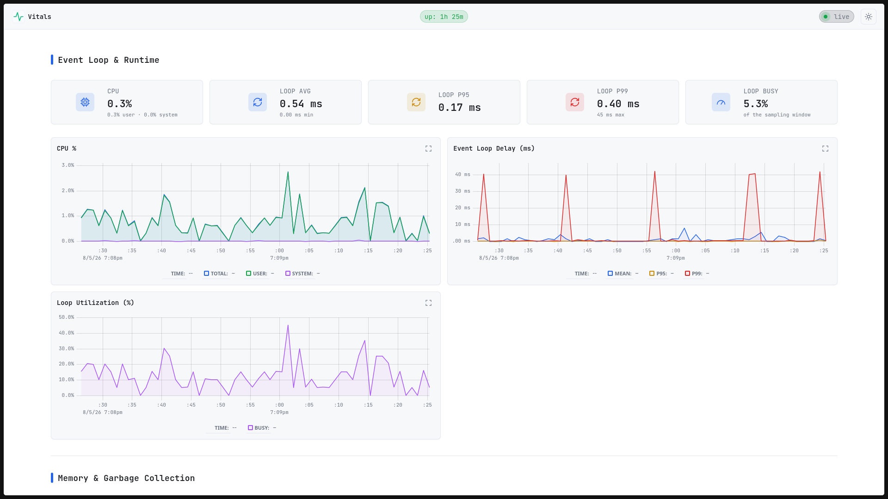
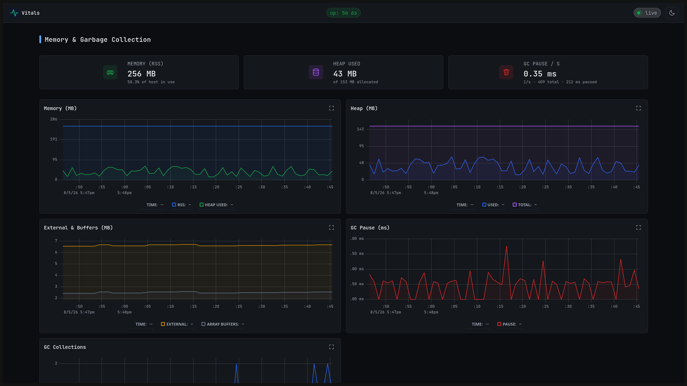

<!-- Banner -->
<div align="center">
  
</div>

---

<p align="center">
  <strong>Lightweight, zero-dependency, real-time monitoring for Node.js servers.</strong>
</p>

> [!IMPORTANT]
> **Framework support is currently limited to Express.**
> Vitals currently ships with an official adapter for Express only. Support for additional Node.js frameworks is planned.

<p align="center">
  <a href="https://www.npmjs.com/package/@vitals/express">
    
  </a>
  <a href="https://nodejs.org">
    
  </a>
  <a href="../../../LICENSE">
    
  </a>
</p>

<div align="center">
  
  
</div>

---

> **Vitals** provides real-time monitoring for Express applications through middleware-based request tracking and a built-in live dashboard.

> [!NOTE]
> Vitals is designed for live inspection and debugging — not long-term metrics storage or alerting.

---

# 🚂 @vitals/express

Express.js integration layer for Vitals.

`@vitals/express` connects Express applications with the Vitals engine by providing request tracking middleware and a dashboard router.

---

## 📥 Installation

```bash
npm install @vitals/express
```

or:

```bash
pnpm add @vitals/express
```

---

## 📋 Requirements

- 🟢 Node.js >= 20
- 🚂 Express 4 or 5

---

## 🚀 Quick start

```ts
import express from "express";
import { VitalsEngine } from "@vitals/core";
import {
  createVitalsRouter,
  vitalsMiddleware,
} from "@vitals/express";

const app = express();

const engine = new VitalsEngine().start();

app.use(
  "/vitals",
  createVitalsRouter({ engine })
);

app.use(vitalsMiddleware(engine));

app.get("/api/health", (_req, res) => {
  res.json({ ok: true });
});

app.listen(3000);
```

Open:

```
http://localhost:3000/vitals
```

---

## ✨ Features

- 📡 **Request monitoring** — automatically tracks Express traffic
- 📊 **Live dashboard** — built-in Vitals UI route
- 🔁 **SSE streaming** — real-time browser updates
- ⏱️ **Latency tracking** — request duration measurements
- 🚦 **Status tracking** — HTTP status distribution
- 🛤️ **Route tracking** — aggregated route metrics
- 🔐 **Authorization support** — protect dashboard access

---

## 🧩 Middleware

```ts
app.use(vitalsMiddleware(engine));
```

The middleware records:

- request count
- response duration
- status codes
- aborted requests

---

## 📊 Dashboard router

```ts
app.use(
  "/vitals",
  createVitalsRouter({
    engine,
  })
);
```

Available endpoints:

| Method | Path | Description |
| --- | --- | --- |
| `GET` | `/` | Dashboard UI |
| `GET` | `/events` | SSE metrics stream |

---

## 🔐 Custom authorization

```ts
createVitalsRouter({
  engine,
  authorize: (req) => {
    return req.headers.authorization === "Bearer token";
  },
});
```

By default, dashboard access is restricted to loopback clients.

---

## ⚠️ Mount order

Mount the dashboard router **before** the middleware:

```ts
app.use("/vitals", createVitalsRouter({ engine }));

app.use(vitalsMiddleware(engine));
```

This prevents the dashboard's long-lived SSE connection from being counted as application traffic.

---

## 🔌 Related packages

- 📦 `@vitals/core` — metrics engine
- 📊 `@vitals/ui` — dashboard interface

---

## 📄 License

MIT © 2026 Ayush Jain
